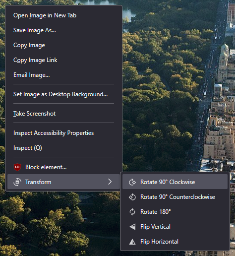

# Image Transform Context Menu Browser Extension

A Firefox and Chrome Manifest V3 browser extension to add context menu items to rotate or flip images and videos.

## Synopsis

This Manifest V3 browser extension adds context menu items for images and videos in webpages in the web browser to rotate and flip images and videos.

The extension follows the WebExtensions API syntax and can be used in Firefox without any further modification. For Chromium based browsers like Google Chrome and Microsoft Edge, the extension must be ported with `make-chrome.sh` first to be used in those browsers.

## Browser Support

The extension should work on most web browsers that support Manifest V3 extensions:

- Firefox 121+
- Edge 121+
- Chrome 121+

Older versions and other Chromium based web browsers may also work but have not been tested.

## Download

## Build

Build the Firefox extension (as `bin/firefox.xpi`) and Chrome extension (as `bin/chrome`) by running:

`make`

Locate the extension (`firefox.xpi` and `chrome`) in the `bin` folder.

## Installation

### Firefox

Download the signed extension package `image-transform-context-menu.xpi` from [Firefox Browser Add-ons](https://addons.mozilla.org/en-US/firefox/addon/image-video-transform/), the [Releases section](../../releases/latest), or compile it yourself using the Build instructions.

Install the extension permanently at `about:addons` or test the extension temporarily at `about:debugging#/runtime/this-firefox`.

For those who compiled the extension yourself, the extension must be signed by Mozilla in order for it to be installed permanently on Firefox Release and Beta channels. Extension signing [requirements can be disabled](https://wiki.mozilla.org/Add-ons/Extension_Signing#FAQ) on Nightly, Developer, and Enterprise channels.

### Chrome and Microsoft Edge and other Chromium based browsers

Download the signed extension package from the Releases section, or compile it yourself using the Build instructions.

Install the extension permanently or test the extension temporarily at `about:extensions`. To test the extension temporarily, enable Developer mode, and click "Load unpacked".

For those who compiled the extension yourself, the extension must be signed in order for it to be installed permanently.

## Usage

Right-click any image or video to open the context menu. Click on any of the newly added Transform context menu items for the desired transform effect.

## Attribution

- [Material Symbols & Icons - Google Fonts](https://fonts.google.com/icons) 
  License: [Apache License Version 2.0](http://www.apache.org/licenses/LICENSE-2.0.txt) 
  Icons (modified) for extension icon and context menu item icons.

## Author

RedAndBlueEraser
